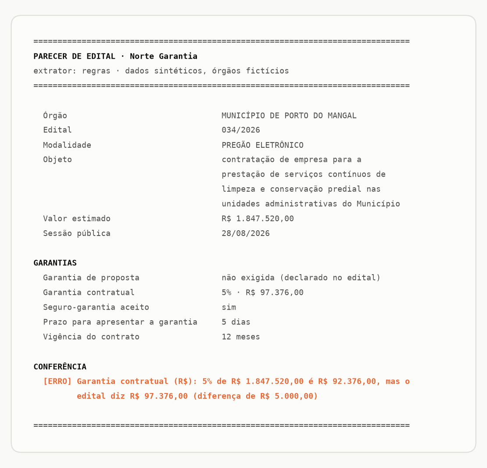
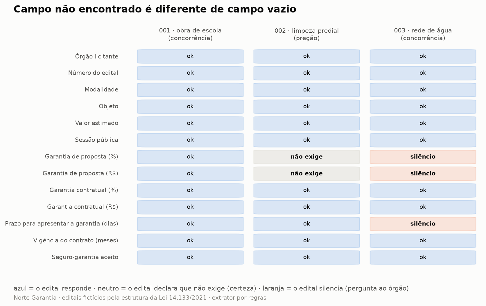

# leitor-de-editais

> **Lê um edital de licitação e devolve o parecer que a corretora precisa:** o que o edital exige de garantia, qual número não bate e, tão importante quanto, o que o edital **não diz**.
>
> A tese do projeto: o valor não está em chamar a IA, está no contrato de saída e na conferência. **Campo não encontrado é diferente de campo vazio.**


<picture>
  <source media="(prefers-color-scheme: dark)" srcset="docs/parecer-dark.png">
  
</picture>

> Repare na seção CONFERÊNCIA: o edital diz "5%" e diz "R$ 97.376,00", e as duas afirmações não podem ser verdade ao mesmo tempo. O parecer não escolhe uma: mostra a conta e acusa a diferença de R$ 5.000,00, porque é a corretora quem vai ligar pro órgão perguntar qual dos dois vale.

---

## O problema

Uma corretora de seguro garantia vive de edital: é lá que está escrito se a licitação exige garantia de proposta, quanto será a garantia contratual, em quantos dias ela precisa ser apresentada e se seguro-garantia é aceito. São umas 13 respostas por edital, espalhadas em dezenas de páginas, e quem cota precisa delas antes de qualquer conta.

O perigo não é a demora de ler. É confiar num número errado, ou seja, num edital que diz "5%" numa linha e um valor que não é 5% na outra. E é tratar silêncio como resposta: um edital que **declara** "não será exigida garantia de proposta" dispensa a corretora de agir; um edital que simplesmente **não fala** no assunto exige uma ligação ao órgão. No formulário, os dois viram campo vazio. Na vida real, são informações opostas.

## O que eu fiz

Um leitor com um contrato no meio:

```
edital -> [extrator] -> JSON validado -> parecer
```

Quatro decisões que não eram óbvias:

**1. Extrator trocável, e o padrão não usa IA.** Dois extratores implementam o mesmo contrato: um por **regras** (determinístico, offline, custo zero, roda em qualquer clone do repo) e um por **modelo** (API da Anthropic, opcional, só liga com chave em variável de ambiente). Trocar um pelo outro não muda uma linha da conferência nem do parecer.

**2. Três estados de campo, não dois.** `encontrado`, `ausente_declarado` e `nao_encontrado`. O parecer trata cada um do seu jeito: valor, certeza registrada e pergunta a fazer ao órgão. Fundir os dois últimos é transformar silêncio em resposta.

**3. Todo valor carrega a prova.** Campo encontrado vem com o trecho literal do edital de onde saiu, e a conferência verifica que o trecho existe mesmo no texto. No extrator por modelo, valor com trecho inventado é descartado e vira problema anotado no parecer, porque valor plausível com origem falsa é o modo de falha mais caro que existe.

**4. A conferência é a mesma para os dois extratores.** Ela interpreta os valores brutos, cruza percentual com valor absoluto, confere os tetos da Lei 14.133/2021 e testa se as datas existem no calendário. Extrator nenhum é confiado: tudo que vira parecer passou por ela.

<picture>
  <source media="(prefers-color-scheme: dark)" srcset="docs/estados-dark.png">
  
</picture>

> Repare nas duas colunas da direita: o edital 002 **declara** que não exige garantia de proposta (assunto encerrado), e o edital 003 **silencia** sobre ela (ligação ao órgão antes de cotar). É a mesma célula vazia num formulário comum, e são decisões diferentes na operação.

## O resultado

```
extrator por regras x gabarito     39/39 campos (status e valor)
defeitos plantados pegos           2 de 2, com a conta exposta
falso alarme no edital limpo       zero
testes                             29, sem chamar API nenhuma
```

A conferência pegou os dois defeitos plantados nos editais fictícios:

- **edital_002:** garantia contratual de "5%" com valor de R$ 97.376,00, quando 5% de R$ 1.847.520,00 é R$ 92.376,00. Diferença de R$ 5.000,00, típica de digitação.
- **edital_003:** sessão pública marcada para **31/06/2026**, uma data que não existe.

E não acusou nada no edital limpo, porque conferência que dá falso alarme é silenciada em uma semana.

## Como rodar

```bash
git clone https://github.com/Lucasnevesads/leitor-de-editais
cd leitor-de-editais
pip install -r requirements.txt

python src/ler.py editais/edital_002.txt      # o parecer da imagem acima
python src/medir.py                           # os 39/39 contra o gabarito
python -m unittest discover -p "teste_*.py"   # os 29 testes
```

O extrator por modelo é opcional e desligado por padrão:

```bash
pip install -r requirements-modelo.txt
# defina ANTHROPIC_API_KEY no ambiente (nunca em arquivo do repo)
python src/ler.py editais/edital_001.txt --extrator modelo
```

---

## 🔍 Detalhe técnico

### As peças

| Arquivo | O que faz |
|---|---|
| `src/contrato.py` | o contrato: os 13 campos, os 3 status e a conferência (`validar`) |
| `src/extrator_regras.py` | extrator padrão: regex sobre a estrutura que a Lei 14.133 induz |
| `src/extrator_modelo.py` | extrator opcional: chamada à API e o parser desconfiado da resposta |
| `src/parecer.py` | o texto final: o que o edital diz, o que a conferência achou, o que o edital não diz |
| `src/ler.py` | CLI: `--extrator regras\|modelo`, `--json`; sai com código 1 se houver achado |
| `src/medir.py` | mede o extrator contra o gabarito de `editais/gabarito/` |

### A chamada à API está escrita e NÃO foi executada

Este repositório foi desenvolvido **sem chave de API**, de propósito: chave não entra em repo, e o fluxo de desenvolvimento não deve depender de segredo nem de custo por execução. A chamada em `extrator_modelo.extrair()` está completa (SDK oficial da Anthropic, modelo `claude-opus-5`, resposta pedida com structured outputs no formato do contrato), mas nunca rodou aqui, e o README diz isso em vez de fingir o contrário.

A aposta técnica: o risco de um extrator por modelo mora quase todo **depois** da rede, e essa parte é 100% testável sem chave. Os testes cobrem:

- **finais anormais da resposta:** recusa (`stop_reason: refusal`), truncamento por `max_tokens` (JSON parcial nunca é tratado como bom) e resposta sem bloco de texto;
- **lixo estrutural:** resposta que não é JSON, JSON que não é objeto, campo faltando, status inventado, valor com tipo errado, campo fora do contrato;
- **o caso que importa:** valor plausível com **trecho que não existe no edital**. O campo é rebaixado para `nao_encontrado` e o problema aparece no parecer. Alucinação não entra em parecer nem como "valor suspeito";
- **equivalência:** uma resposta bem-formada produz extração idêntica à do extrator por regras e passa pela mesma conferência.

O structured outputs (`output_config.format` com JSON schema) elimina o JSON malformado na origem, mas a validação local existe do mesmo jeito: schema garante forma, não verdade, e código não executado não tem garantia comprovada.

### O que a conferência confere

| Verificação | Exemplo pego nos editais fictícios |
|---|---|
| trecho de prova existe no texto | trecho parafraseado ou inventado derruba o campo |
| valor bruto interpretável | `"R$ 1.847.520"` sem centavos seria recusado |
| data existe no calendário | `31/06/2026` no edital_003 |
| percentual × valor estimado batem | R$ 5.000,00 de diferença no edital_002 |
| tetos da Lei 14.133/2021 | proposta > 1% (art. 58, § 1º) ou contratual > 5% (art. 98) |

### Limitações

- **A integração com a API não tem garantia comprovada.** Um erro de parâmetro na chamada (nome de campo do SDK, formato do schema) só apareceria na primeira execução com chave. Tudo a partir dos bytes recebidos está testado; a chamada em si, não.
- **Três editais, escritos no padrão.** Eles seguem a estrutura usual da lei e provam o contrato e a conferência, não a robustez do extrator de regras contra o mundo real: PDF escaneado, OCR, seções renumeradas e redações criativas ficam de fora. É exatamente o caso de uso do extrator por modelo, que é a parte não executada.
- **A conferência cruzada usa o valor estimado como base.** Edital que calcule a garantia sobre outra base (lote, item, valor anual) geraria divergência falsa, com a conta exposta no parecer para uma pessoa decidir.
- **O teto conferido é o do art. 98 (5%).** Obra de grande vulto pode ter até 10% (art. 99); um edital legítimo nesse caso seria acusado indevidamente. O parecer mostra a base legal junto do achado para o leitor julgar.
- **`seguro_garantia_aceito: nao` depende da lista de modalidades.** A prova da negativa é a frase que enumera as modalidades sem citar seguro-garantia; edital que aceite garantia sem enumerar modalidades vira `nao_encontrado`.

---

## 🧪 Sobre os dados

Este projeto faz parte da trilha da **Norte Garantia**, uma corretora de seguro garantia **fictícia**. Aqui os dados não vêm da [base sintética](https://github.com/Lucasnevesads/base-sintetica-seguros): são **três editais fictícios**, escritos seguindo a estrutura da Lei 14.133/2021 (que é pública), com órgãos inventados — Serra do Lume e Porto do Mangal não existem. Dois trazem defeitos plantados de propósito, com gabarito em `editais/gabarito/`.

Nenhum edital real, nenhum órgão real e nenhum dado de empresa real é usado, em nenhuma etapa. Chave de API nunca entra no repositório.

O nome da empresa fica isolado em [`config/empresa.yml`](config/empresa.yml). O código tem uma trava: se alguém mudar `sintetico: true` para `false`, o projeto para de rodar.

---

## 📄 Documentação

- [`docs/decisoes.md`](docs/decisoes.md) · por que cada escolha foi feita, e o que ela custou
